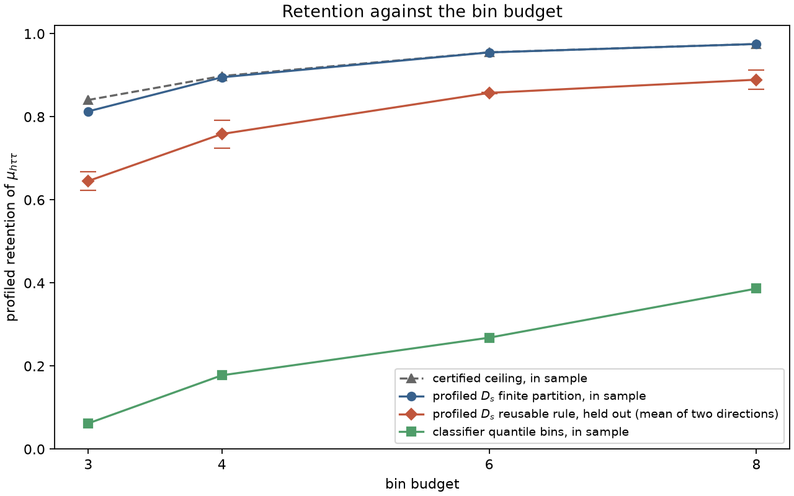
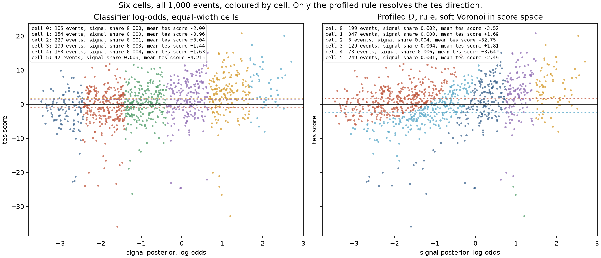

# HEP classifier study: a tau-energy-scale nuisance from the FAIR Universe HiggsML dataset

This page is the reference study behind the portal's
[HEP walkthrough](https://vitalyvorobyev.github.io/scorequant/walkthroughs/hep/). It walks
[Door 3](../../book/ch04-scores-and-doors.md) (classifier to density ratios to scores) through
profiled \(D_s\) on a real particle-physics dataset: the
[FAIR Universe HiggsML Uncertainty Challenge](https://doi.org/10.5281/zenodo.15131565) public
sample, with an explicit tau-energy-scale (`tes`) nuisance. It is the project's only example
that estimates a nuisance-shape score column through the library's central-difference door,
`CentralLogRatioScore`, and the only one whose reusable rules are evaluated on events they never
saw and carried through to a downstream signal-strength fit.

Everything here is a simulation study on a committed 1,000-event fixture, not a measurement.

## The measurement

The model is an extended linear intensity over the fixture's events,

$$\lambda(x;\mu,\nu,\alpha)=\mu\,s(x;\alpha)+\nu\,b(x;\alpha),$$

with reference point \(\theta_0=(1,1,1)\) and three parameters: \(\mu\), the `htautau` signal
rate (**of interest**); \(\nu\), the combined background rate (nuisance, normalization); and
\(\alpha\), the tau energy scale `tes` (nuisance, shape).

**The energy scale is unconstrained.** Nothing in this study adds an external constraint on
\(\alpha\): neither the profiled criterion, nor the profiled information any retention number
divides by, nor the primary downstream uncertainty. A Gaussian constraint of width 0.01 is
recorded next to the downstream number to show what a physical constraint would change (below:
nothing, at this fixture's yields).

**Why the backgrounds are collapsed.** `ztautau`, `ttbar`, and `diboson` are collapsed into one
background component. This is forced, not chosen: the committed sample carries 634 `ztautau`,
26 `ttbar`, and 4 `diboson` rows -- far too few of the latter two to support separate rate
normalizations. A reader who knows the challenge will expect the three background normalizations
upstream's `systematics.py` exposes; this study measures one combined background rate instead.

## Data and provenance

The fixture (`examples/data/hep_higgsml_fixture.npz`, 0.59 MB) holds seven row-aligned feature
matrices of the same 1,000 events, one per committed `tes` value, `tes` in
`{0.90, 0.95, 0.975, 1.00, 1.025, 1.05, 1.10}`, alongside Monte Carlo event weights and process
labels. `examples/hep_classifier/fixture.py` is the recorded build procedure -- it is **never**
run by the example, the tests, or CI -- and its sibling `.json` records provenance as three
separate facts, not one collapsed licence line:

- **Where the bytes came from:** `input_data/FAIR_Universe_HiggsML_data.parquet` in
  `FAIR-Universe/HEP-Challenge` at commit `31816a0d8c8dda03d4b28d9e824674821756962b`.
- **That the code repository carries no licence file.** The bytes were fetched from a repository
  with no licence of its own.
- **Which record the CC-BY-4.0 claim is made under:** the Zenodo archival record for the public
  dataset, DOI [`10.5281/zenodo.15131565`](https://doi.org/10.5281/zenodo.15131565), CC-BY-4.0 --
  not the code repository.

**The weights.** Background events carry weights up to 1584 and signal events as little as 3, so
the weighted signal fraction is 0.00099 and the 1,000 rows are worth about 665 equally weighted
events. The fixture's total weight, 1.05 million, is a subsample sum: it is not the challenge's
expected yield, and no absolute sensitivity below is a projection.

**Why `dopostprocess=False`.** Upstream's `tes` transformation rescales `PRI_had_pt`, recoils the
missing transverse momentum against the rescaled tau four-vector, and recomputes every derived
column from the shifted primaries -- ten of the twenty-eight feature columns respond. Upstream
then re-applies the `PRI_had_pt > 26` selection, which drops 169 of the 1,000 rows at
`tes = 0.90`. That is an acceptance change: the density ratio between a shifted-down and a
shifted-up sample would diverge at the selection threshold, and a central-difference estimate over
1,000 events cannot resolve it. The fixture holds the selection fixed
(`dopostprocess=False`) so every variant keeps the same 1,000 rows. This example therefore
measures the **shape** sensitivity of the features to the tau energy scale, not the acceptance
sensitivity -- a deliberate modelling choice, not an oversight.

## The classifier-to-score bridge

Two classifiers, through two different ratio doors:

- **The rate columns** (`mu_htautau`, `nu_background`) come from a signal-vs-background classifier
  through `DensityRatioScore.from_classifier` under
  `IntensityParameterization(coefficients=[1 - f, f])`, where `f` is the weighted signal fraction.
  Once the ratio is known the rate score is closed-form, so it is never finite-differenced.
- **The `tes` column** has no closed form: `tes` is a deterministic transformation of the
  features, so a `tes = 1 - delta` and a `tes = 1 + delta` sample are built from the same fixture
  rows, and a classifier trained to separate them feeds `CentralLogRatioScore`, the library's
  central-difference door.

Both classifiers are cross-fitted **out-of-fold with one fold id per event**, reused by both
`tes` copies of that event, and both are trained **under the Monte Carlo weights**. Three failure
modes produce plausible-looking wrong numbers if this is missed:

- **Fold leakage inverts the `tes` score.** Eighteen of the twenty-eight feature columns do not
  respond to `tes` at all, so under a plain per-row split the classifier memorizes an event from
  its static columns and answers with the label of the copy it trained on -- the *opposite* one.
  The design record measured an out-of-fold AUC of 0.3424 (below chance) with a plain
  `StratifiedKFold`, and above 0.57 once folds are grouped by event.
- **Raw Monte Carlo weights make the signal invisible to the rate classifier.** The
  signal/background classifier trains on per-class normalized weights with declared priors
  `(0.5, 0.5)`; the physical rate ratio enters through the `IntensityParameterization`
  coefficients, never through the priors -- the library's own doctrine that importance ratios are
  source weights, not provider inputs.
- **Dropping the weights from the `tes` classifier estimates the wrong ratio.** The two copies of
  an event share its weight, so the minus/plus classes are balanced by construction and no class
  correction is needed -- but the weights themselves are essential. The `tes` score column is
  the derivative of the log density of the *physical* mixture, which is one part in a thousand
  signal; the unweighted event list is one third signal. An earlier version of this study trained
  the `tes` classifier unweighted, and the downstream section below is where it showed: with that
  column the profiled rule lost to the plain-D rule once the energy scale floated. The weighted
  minus/plus AUC is 0.5753 (`n_folds=5`, `max_iter=300`).

The fold models are kept, so the same out-of-fold rule scores an event's shifted copies. That is
what turns a reusable bin rule into yield templates for the downstream fit.

```python
from examples.hep_classifier import SCHEMA, load_fixture, load_provenance

data = load_fixture()
provenance = load_provenance()

assert data.n_events == 1_000
assert int(data.is_signal.sum()) == 336
assert SCHEMA.parameters == ("mu_htautau", "nu_background", "tes")
assert SCHEMA.select("mu_htautau") == (0,)
assert provenance["source_license"] == "CC-BY-4.0"
assert provenance["license_record_doi"] == "10.5281/zenodo.15131565"
```

**How reproducible is the `tes` column?** Two `tes` classifiers trained on disjoint thirds of
the events and evaluated on the remaining third agree on the central-difference score at a
weighted correlation of 0.50 (`classifiers.tes_reliability` in the evidence file). The rest is
per-event estimation noise. Profiled information is invariant under any invertible linear
rescaling of the nuisance column, so the finite-difference step `delta` and the calibration
temperature cannot bias it; independent per-event noise can, and does, in one direction: it
inflates the unbinned nuisance information, shrinks the profiling penalty in the denominator, and
biases every reported retention *down*. The retentions on this page are therefore conservative
with respect to the proxy's own noise.

## The in-sample study on all events

Binning on the signal posterior \(\eta_s\) alone should lose profiled information, because
\(\eta_s\) is built to separate signal from background and knows nothing about `tes`: the region
where the signal concentrates is also where the tau energy scale moves events most, so profiling
over `tes` eats what those bins carry. **This is a prediction, not a guaranteed result**, and
the run reports whatever it produces.

Every labeling below is reported twice: full-\(D\) retention (the whole three-parameter Fisher
matrix) and profiled-\(D_s\) retention (the information about \(\mu\) alone, after \(\nu\) and
`tes` are Schur-completed out). The first two rows are finite partitions of the 1,000 rows and
label nothing else; the rest are reusable rules, applied here to the rows they were built on.

| Labeling, 6 cells unless stated | Full \(D\) retention | Profiled \(D_s\) retention |
| --- | --- | --- |
| Profiled \(D_s\) finite partition | 0.4784 | **0.9550** |
| Plain \(D\) finite partition | 0.8746 | 0.8238 |
| Profiled \(D_s\) reusable rule (soft Voronoi) | 0.5620 | 0.9145 |
| Plain \(D\) reusable rule (compiled exchange) | 0.8746 | 0.8238 |
| Classifier intervals, max \(S^2/(S+B)\) | 0.2307 | 0.3315 |
| Classifier logit, equal width | 0.2436 | 0.3333 |
| Classifier quantile bins | 0.2314 | 0.2682 |
| Significance cut, 2 cells | 0.0000 | not identified |

The classifier-output rules are the baselines a physicist would build. Equal-frequency cells of
\(\eta_s\) hold equal numbers of simulated events; equal-width cells of
\(\operatorname{logit}\eta_s\) spread out the pile of posteriors near zero that a 0.1% signal
fraction produces; and the interval rule chooses six contiguous intervals of \(\eta_s\) by exact
dynamic programming to maximise \(\sum_b S_b^2/(S_b+B_b)\), the Asimov information for \(\mu\)
with every nuisance held fixed, under the usual requirement of at least ten simulated background
events per interval (without that requirement the search isolates background-free pockets of a
handful of signal events, which look infinitely informative and are a Monte Carlo artefact). The
three retain between a quarter and a third of the profiled information, and the spread between
them (0.0650) is far smaller than the gap to the profiled partition (0.6218 against the best of
them). No binning of a signal-versus-background score can recover what that score never encoded.

The two-bin significance cut, a single threshold on \(\eta_s\) chosen to maximise
\(S/\sqrt{B}\), is not identified under three floating parameters: two counts cannot determine
three quantities, so its profiled information is not a small number but an undefined one. It is
kept as the conventional reference and reported as such rather than as zero.

Each criterion wins on its own objective and gives up on the other: the profiled partition gives
up 0.3962 of full retention to gain 0.1312 of profiled retention over the plain-\(D\) partition.

`efficient_score_bound` supplies the certified ceiling. At six cells, the profiled partition
(`DExchangeConfig(seed=11)`, seeded from the bound's own labels) retains 0.9550 against a
ceiling of 0.9553: a retention gap of 0.0002, and 0.0003 nats of the profiled log-determinant.
It is not merely better than the baselines; it is as good as any six-cell rule of this score
space could be, in sample.

| Cells | Profiled \(D_s\) partition | Classifier quantile bins | Certified ceiling | Certified gap (nats) |
| --- | --- | --- | --- | --- |
| 3 | 0.8131 | 0.0620 | 0.8406 | 0.0332 |
| 4 | 0.8952 | 0.1776 | 0.8982 | 0.0034 |
| 6 | 0.9550 | 0.2682 | 0.9553 | 0.0003 |
| 8 | 0.9753 | 0.3864 | 0.9753 | 0.0000 |

## Held out: every rule built on one half, scored on the other

A partition labels the rows it was optimized on. A search needs a rule, and a rule has to be
evaluated on events it never saw. The events are split once (`event_split`, seed 7), stratified
by label, into two halves of 500. Every rule is built on one half and scored on the other, in
both directions; the classifier-output rules choose their edges on the reference half. The
profiled \(D_s\) rule is `fit_quantizer` with `SoftVoronoiConfig(seed=11, initializer_restarts=8,
max_steps=400)` and the evaluation half passed as `validation=`, which is diagnostic only; the
held-out number is re-derived from `predict_scores` and agrees with the library's own
`validation_profiled_report` to every printed digit. The plain-\(D\) rule is the exchange
partition of the reference half compiled into its Voronoi rule. Each evaluation half also gets
its own certified ceiling, so no held-out number can sit above the best any rule could do on
that half.

The parameterization (the physical signal fraction) and both calibration temperatures are the
full-sample values, frozen across the split, so both halves' score tables live in one
parameterization. The residual coupling -- each half's out-of-fold scores come from fold models
that saw some events of the other half -- is second-order and is the standard cross-fitting
arrangement.

| Rule | Reference half, in sample | Held out, mean of both directions | Held out, direction A→B | Held out, direction B→A | Bootstrap envelope (5th to 95th, both directions) |
| --- | --- | --- | --- | --- | --- |
| Profiled \(D_s\) finite partition | 0.9673 / 0.9638 | -- | -- | -- | -- |
| Profiled \(D_s\) rule | 0.9282 | **0.8576** | 0.8591 | 0.8561 | 0.8051 to 0.9146 |
| Plain \(D\) rule | 0.8438 | 0.8025 | 0.8191 | 0.7858 | 0.7311 to 0.8639 |
| Classifier intervals, max \(S^2/(S+B)\) | 0.3294 | 0.3244 | 0.2494 | 0.3994 | 0.1042 to 0.8063 |
| Classifier logit, equal width | 0.4169 | 0.2712 | 0.3434 | 0.1989 | 0.1088 to 0.8656 |
| Classifier quantile bins | 0.2633 | 0.3682 | 0.3186 | 0.4177 | 0.1206 to 0.8330 |
| Certified ceiling of the evaluation half | -- | -- | 0.9642 | 0.9699 | -- |

Three numbers of the profiled rule belong together: the finite partition on the reference half
(in sample, a labelling of those rows), the reusable rule on the reference half (the cost of
being a rule at all: 0.9673 to 0.9282 in one direction), and the reusable rule held out (the
cost of new events: to 0.8591). The bootstrap resamples the evaluation events with replacement,
200 times, with the labels travelling with the rows, so it reflects the Monte Carlo sample's size
and nothing about how the rule was fitted; the distributions are skewed and bounded by one, which
is why percentiles are quoted rather than a standard error. The classifier-output rules' envelopes
are wide enough that which of them is best changes from one direction of the split to the other.

**Occupancy.** The profiled rule's advantage lives in small cells: its smallest evaluation cell
holds 2 simulated events in one direction and 15 in the other, while the quantile bins' smallest
holds 72. That is the price of resolving the `tes` direction on a 1,000-event fixture, and it is
where the Monte Carlo statistical caveat of the downstream section comes from. Per-cell tables
(events, weighted yield, signal share, mean `tes` score) for every rule and both directions are in
`cross_evaluation.directions[*].rules[*].evaluation_occupancy` of the evidence file.

**Held-out budget sweep.** The reusable profiled rule, held out, retains 0.6455 at three cells,
0.7586 at four, 0.8576 at six and 0.8893 at eight, against in-sample partitions of 0.8131, 0.8952,
0.9550 and 0.9753 and the ceilings above.



## Downstream: the signal-strength fit on the count table

Retention is a property of the score proxy. What a search reports is an uncertainty on \(\mu\)
from the count table's own likelihood, and that can be computed from the simulation's actual
energy-scale response rather than the classifier's estimate of it. Each reusable rule is applied
to every event's copy at all seven committed `tes` values, giving yield templates
\(S_b(\alpha)\) and \(B_b(\alpha)\) per cell, and the Asimov binned-Poisson Fisher matrix at
\((\mu,\nu,\alpha)=(1,1,1)\) is \(\sum_b g_b g_b^\top/N_b\) with
\(g_b=(S_b, B_b, \partial N_b/\partial\alpha)\). The `tes` derivative is the slope of a
least-squares line through the seven points, because a central difference on a few hundred events
is dominated by single events crossing a boundary. The relative expected uncertainty on \(\mu\) is
\(\sqrt{[I^{-1}]_{\mu\mu}}\).

The finite partitions cannot enter this table: they label the nominal rows and have no rule to
apply to a shifted copy.

| Rule, 6 cells, fitted on all events | \(\sigma(\mu)\), `tes` fixed | \(\sigma(\mu)\), `tes` floating | with MC statistics, `tes` floating |
| --- | --- | --- | --- |
| Profiled \(D_s\) rule | 0.700 | **0.720** | 28.6 |
| Plain \(D\) rule | 0.735 | 0.765 | 30.4 |
| Classifier intervals, max \(S^2/(S+B)\) | 0.596 | 1.909 | 75.8 |
| Classifier logit, equal width | 0.636 | 1.460 | 58.0 |
| Classifier quantile bins | 0.669 | 1.190 | 47.3 |
| Significance cut, 2 cells | 0.672 | not identified | -- |
| Unbinned proxy score | 0.856 | 0.869 | -- |

With `tes` fixed every rule measures \(\mu\) about equally well, and the classifier-output rules
are slightly ahead: they were built for that question. With `tes` floating they lose a factor of
1.8 to 3.2, because their counts cannot tell a shifted energy scale from a changed signal
strength; the profiled rule loses 3%, the plain-\(D\) rule 4%. This is the scientific content of
the study stated in the reported quantity, and it is the reason the walkthrough leads with it.

Three notes on the table:

- **The unbinned proxy row is not a floor for the template rows.** It is the Fisher information
  of the classifier-estimated score, \(\sum_i w_i s_i s_i^\top\), divided by the signal fraction;
  the template rows use the simulation's labels for \(S_b\) and \(B_b\), which the classifier
  only estimates. The two are on different footings and only the ordering within each footing is
  meaningful.
- **Monte Carlo statistics dominate.** The yields are 1,000 rows scaled up by weights near 1580,
  so the Barlow-Beeston-lite inflation \(\mathrm{Var}(N_b)=N_b+\sum_{i\in b}w_i^2\) is about
  forty times the Poisson variance. The last column includes it; every absolute number becomes a
  property of the fixture's Monte Carlo size, and the ranking survives.
- **A physical constraint on `tes` changes nothing here.** Adding \(1/0.01^2\) to the `tes`
  diagonal moves the profiled rule's \(\sigma(\mu)\) from 0.7198 to 0.7197: the yields
  self-constrain the energy scale far below a 1% width.

**Held out.** The same table on each evaluation half, with rules built on the other half:

| Rule | A→B, `tes` fixed | A→B, floating | B→A, `tes` fixed | B→A, floating |
| --- | --- | --- | --- | --- |
| Profiled \(D_s\) rule | 0.913 | 1.145 | 0.888 | 0.897 |
| Plain \(D\) rule | 0.976 | 1.026 | 0.959 | 0.971 |
| Classifier intervals | 0.888 | 1.405 | 0.910 | 1.715 |
| Classifier logit, equal width | 0.929 | 1.447 | 0.857 | 1.254 |
| Classifier quantile bins | 0.934 | 1.825 | 0.922 | 1.579 |

On 500 events the count table cannot rank rules whose uncertainties differ by less than about a
third: the two ScoreQuant rules trade places between the directions, while every classifier-output
rule sits above both in both directions. That is why the all-events table is the one the
walkthrough shows, with its in-sample optimism for the rules (the classifier-output rules'
edges were chosen on the same labels) stated next to it.

## The delta convergence study

`delta` is the finite-difference half-offset the central-log-ratio classifier is trained at, and
**it is a numerical differentiation step, not the physical tau-energy-scale uncertainty**, which
is nearer 1-3%. The score is the derivative of the log density at `tes = 1` whatever prior width
`tes` carries downstream, and reading these numbers as a physics uncertainty claim would be wrong.

The headline `delta = 0.05` is checked against `delta = 0.025` and `delta = 0.10`, the three
points the committed fixture carries; the partitions are in sample, on all events:

| \(\delta\) | Minus/plus classifier AUC (weighted) | Near-\(0.5\) fraction | Profiled \(D_s\) retention | Certified ceiling |
| --- | --- | --- | --- | --- |
| 0.025 | 0.5379 | 0.071 | 0.9552 | 0.9566 |
| 0.05 | 0.5753 | 0.065 | 0.9550 | 0.9553 |
| 0.10 | 0.6786 | 0.045 | 0.9527 | 0.9532 |

The minus/plus classifier's own discrimination task grows markedly easier with `delta`, yet the
profiled retention at a fixed six-cell budget barely moves; the correlation between the `delta`
and `delta/2` score columns is 0.64, so individual events' estimated scores shift more than the
aggregate does. This is the linear-rescaling invariance stated above, seen empirically: the
partition built from either column agrees on what matters for this measurement.

## What the categories look like



The classifier output is one number, so any binning of it is a set of vertical stripes in this
plane. The profiled rule keeps cells whose mean `tes` score differs, which is what lets the count
table register an energy-scale shift as a nuisance change rather than as a signal change.

## Discussion

**Task:** both. `optimize_partition` for the in-sample partitions and the ceiling, which are
statements about this score table; `fit_quantizer` (and, for plain \(D\), the compile bridge) for
the rules, which are the objects a search could deploy and the only ones evaluated held out and
downstream. **Door:** 3, classifier to density ratios to scores, through two different ratio
doors -- `DensityRatioScore.from_classifier` for the rate columns and `CentralLogRatioScore` for
the nuisance-shape column. **Criterion / solver:** `DOptimality` and
`ProfiledDOptimality(interest=("mu_htautau",))` with `DExchangeConfig` for the finite partitions,
`SoftVoronoiConfig` for the reusable profiled rule, the same pairing
[`nuisance-profiled-ds`](../../examples/nuisance-profiled-ds.md) and
[`michelson-phase`](../../examples/michelson-phase.md) use, and for the same reason: finite
profiled-\(D_s\) labels have no canonical inductive rule to compile into.

**What would change the numbers.** A larger fixture. The held-out envelopes and the downstream
noise on 500 events are both consequences of 1,000 rows and 665 effective events; the fixture
builder needs the network and packages the project does not depend on, so enlarging it is a data
decision rather than a code change.

Every number on this page is read from the committed evidence JSON
(`docs/examples/assets/hep-classifier.json`), regenerated deterministically by
`JAX_ENABLE_X64=1 MPLBACKEND=Agg uv run python -m examples.hep_classifier` (about two minutes)
and pinned in `tests/test_evidence_suite.py`. The matching notebook,
[`hep_classifier.ipynb`](https://github.com/VitalyVorobyev/scorequant/blob/main/examples/notebooks/hep_classifier.ipynb),
runs the classifier-to-score bridge live at fast-mode scale and re-derives the same tables.
